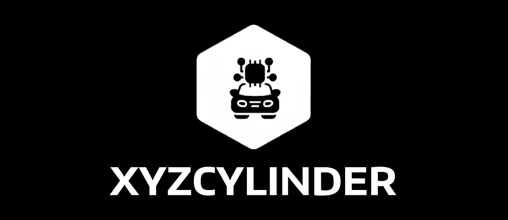
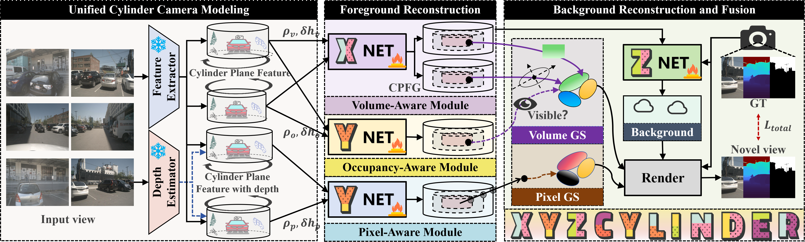
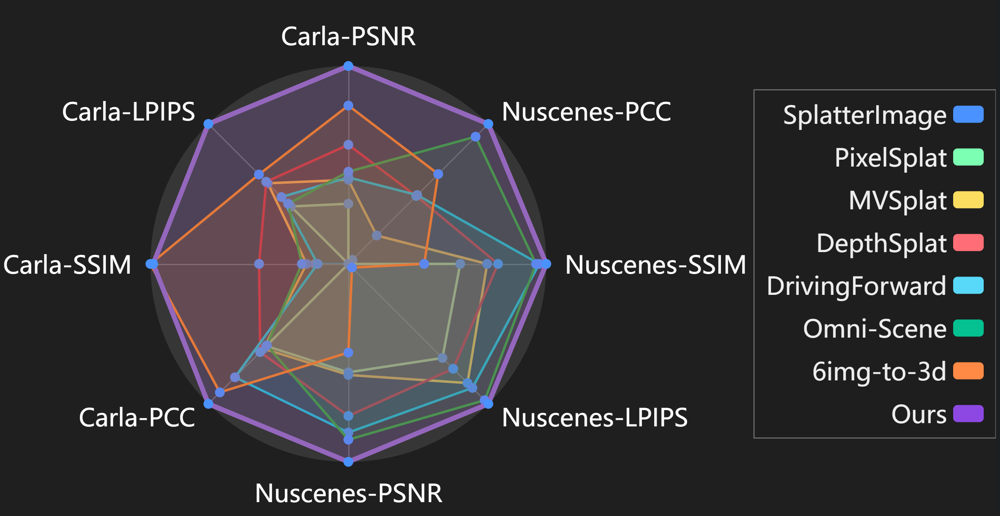

<div align="center">
  <a href="https://github.com/{{github_username}}/{{github_repo_name}}">
    
  </a>
</div>

---

<h1 align="center">
  
XYZCylinder: Towards Compatible Feed-Forward 3D Gaussian Splatting for Driving Scenes via Unified Cylinder Lifting Method
  
</h3>

<h3 align="center">
  
  <a href="https://yuyuyu223.github.io/howsenfisher.github.io/">Haochen Yu</a>,
  <a href="https://scholar.google.com/citations?user=TNDbzzMAAAAJ&hl=zh-CN">Qiankun Liu</a>,
  <a href="https://scholar.google.com/citations?user=Gt3-rnAAAAAJ&hl=zh-CN">Hongyuan Liu</a>,
  <a href="https://jianfeij.github.io/">Jianfei Jiang</a>,
  <a href="https://openreview.net/profile?id=~Juntao_Lyu1">Juntao Lyu</a>,
  <a href="https://scholar.google.com/citations?user=A1gA9XIAAAAJ&hl=zh-CN">Jiansheng Chen</a>,
  <a href="http://www.3dimagelab.com/index.php/huimin-ma/">Huimin Ma</a>
  
</h3>
<h3 align="center">
  
  University of Science and Technology Beijing
  
</h3>

<p align="center">
<a href="#">
      
    </a>
    <a href="#">
      
    </a>
    <a href="https://yuyuyu223.github.io/XYZCYlinder-projectpage/">
      
    </a>
    <a href="https://huggingface.co/howsenfisher/XYZCylinder">
      
    </a>
    <a href="https://www.modelscope.cn/models/yuyuyu223/XYZCylinder">
      
    </a>
    <!-- <a href="#">
      
    </a>
    <a href="#">
      
    </a> -->
    <a href="#">
      
    </a>
    <!-- <a href="#">
      
    </a> -->
  </p>


##  News!!
* [2025-10-09] We have released the project page of XYZCylinder.


##  TODO List

* [ ] Release the checkpoints in huggingface and modelscope.
* [ ] Release the whole code.
* [ ] Release the code of occ-branch training.
* [ ] Release the Carla-Centric dataset.
* [X] Release the project page.

##  About


Feed-forward paradigms for 3D reconstruction have become a focus of recent research, which learn implicit, fixed view transformations to generate a single scene representation. However, their application to complex driving scenes reveals significant limitations. Two core challenges are responsible for this performance gap. First, the reliance on a fixed view transformation hinders compatibility to varying camera configurations. Second, the inherent difficulty of learning complex driving scenes from sparse 360° views with minimal overlap compromises the final reconstruction fidelity. To handle these difficulties, we introduce **XYZCylinder**, a novel method built upon a unified cylinder lifting method that integrates camera modeling and feature lifting. To tackle the compatibility problem, we design a Unified Cylinder Camera Modeling (UCCM) strategy. This strategy explicitly models projection parameters to unify diverse camera setups, thus bypassing the need for learning viewpoint-dependent correspondences. To improve the reconstruction accuracy, we propose a hybrid representation with several dedicated modules based on newly designed Cylinder Plane Feature Group (CPFG) to lift 2D image features to 3D space. Extensive evaluations confirm that XYZCylinder not only achieves state-of-the-art performance under different evaluation settings but also demonstrates remarkable compatibility in entirely new scenes with different camera settings in a zero-shot manner.

##  Results


##  Citation

If you find this repository useful for your research, please use the following BibTeX entry for citation.
```
@misc{yu2025xyzcylindercompatiblefeedforward3d,
      title={XYZCylinder: Towards Compatible Feed-Forward 3D Gaussian Splatting for Driving Scenes via Unified Cylinder Lifting Method}, 
      author={Haochen Yu and Qiankun Liu and Hongyuan Liu and Jianfei Jiang and Juntao Lyu and Jiansheng Chen and Huimin Ma},
      year={2025},
      eprint={2510.07856},
      archivePrefix={arXiv},
      primaryClass={cs.CV},
      url={https://arxiv.org/abs/2510.07856}, 
}
```


